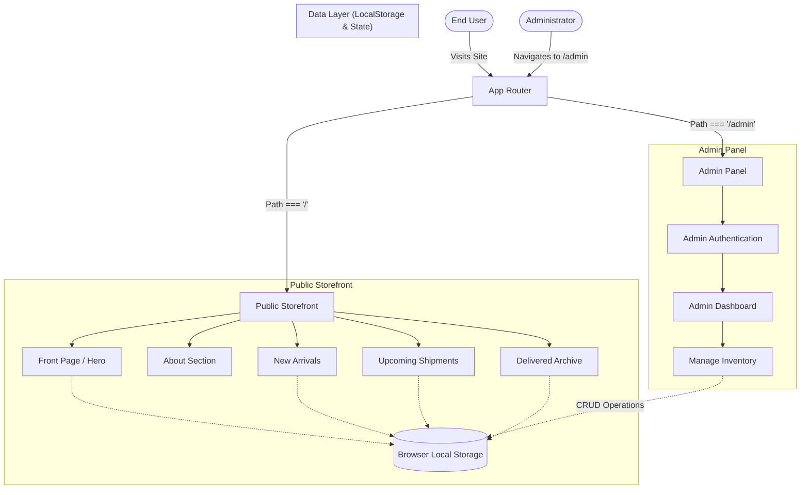

# GoodTime Watch SG ⌚

A premium luxury watch dealership web application built for the Bangladesh market. This platform features a high-end, responsive storefront for exploring curated luxury timepieces, and a secure backend administrative panel for managing products, incoming shipments, and delivered orders.

---

## 🌟 Features

### 🛍️ Client Storefront
- **Luxury UI/UX:** Dark-mode optimized, glassmorphism design using Tailwind CSS.
- **Dynamic Content:** View New Arrivals, Upcoming Collections, and Successfully Delivered items.
- **WhatsApp Concierge:** Direct purchasing and inquiries through automated WhatsApp links with pre-filled product details.
- **Interactive Animations:** Custom scroll-to-hide floating headers, auto-collapsing action buttons, and animated hero sections.
- **Responsive Layout:** Perfectly adapted for desktop, tablet, and mobile viewing.

### ⚙️ Admin Portal (`/admin`)
- **Inventory Management:** Full CRUD (Create, Read, Update, Delete) capabilities for watch collections.
- **Secure Access:** Discreet routing mechanism separate from the main public application.
- **Local Persistence:** Data is securely stored and managed using browser `localStorage` to ensure immediate updates without requiring a backend database setup.

---

## 🛠️ Tech Stack

- **Framework:** [React 18](https://reactjs.org/) + [Vite](https://vitejs.dev/)
- **Language:** [TypeScript](https://www.typescriptlang.org/)
- **Styling:** [Tailwind CSS v3](https://tailwindcss.com/)
- **Icons:** [Lucide React](https://lucide.dev/)
- **State Management:** React Hooks + Local Storage
- **Routing:** Conditional component rendering based on path and state.

---

## 📐 Architecture Diagram

Below is the high-level architecture graph of the application:



---

## 📂 Project Structure

```text
goodtime-watch-sg/
├── src/
│   ├── components/         # Reusable React components (Header, Footer, Sections, Admin)
│   ├── data/               # Default fallback data (goodtime.ts)
│   ├── utils/              # Helper functions (storage.ts, whatsapp.ts)
│   ├── types.ts            # TypeScript interfaces and type definitions
│   ├── App.tsx             # Main application router and state holder
│   ├── main.tsx            # Application entry point
│   └── index.css           # Global CSS and Tailwind directives
├── public/                 # Static assets
├── package.json            # Project dependencies and scripts
├── vite.config.ts          # Vite bundler configuration
└── tsconfig.json           # TypeScript configuration
```

---

## 🚀 Getting Started (Run Locally)

**Prerequisites:** [Node.js](https://nodejs.org/en/) installed on your machine.

1. **Clone the repository:**
   ```bash
   git clone https://github.com/SayhamKayes/GoodTime-Watch.git
   cd goodtime-watch-sg
   ```

2. **Install dependencies:**
   ```bash
   npm install
   ```

3. **Start the development server:**
   ```bash
   npm run dev
   ```

4. **View the app:**
   - **Public Site:** Open [http://localhost:3000](http://localhost:3000)
   - **Admin Panel:** Open [http://localhost:3000/admin](http://localhost:3000/admin)

---

## 🌍 Deployment Guide (cPanel / Shared Hosting)

Because this is a Single Page Application (SPA), deploying it to a standard Apache cPanel environment requires a specific `.htaccess` configuration to handle routing.

1. **Build the Project:**
   ```bash
   npm run build
   ```
   This will generate a `dist` folder containing the production-ready static files.

2. **Upload to cPanel:**
   - Compress the **contents** (not the folder itself) of the `dist` folder into a `.zip` file.
   - Go to your cPanel -> **File Manager** -> `public_html`.
   - Upload and extract the `.zip` file.

3. **Configure Routing (`.htaccess`):**
   - Create a file named `.htaccess` in the `public_html` directory and paste the following code. This ensures that direct visits to routes like `/admin` do not result in a 404 error.

   ```apache
   <IfModule mod_rewrite.c>
     RewriteEngine On
     RewriteBase /
     RewriteRule ^index\.html$ - [L]
     RewriteCond %{REQUEST_FILENAME} !-f
     RewriteCond %{REQUEST_FILENAME} !-d
     RewriteCond %{REQUEST_FILENAME} !-l
     RewriteRule . /index.html [L]
   </IfModule>
   ```

4. **Verify Deployment:**
   - Visit your domain and test the routing to ensure both the storefront and the `/admin` path work as expected.
